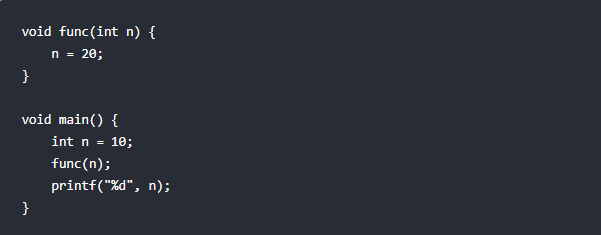
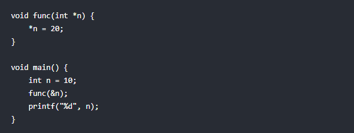
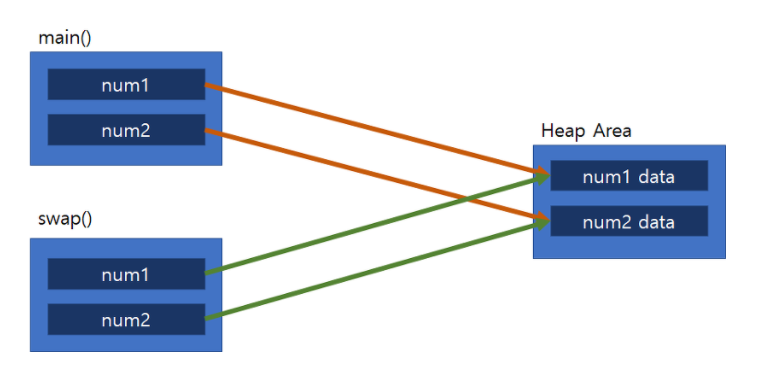

# Call By Value & Call By Reference

## call by value : 값에 의한 호출

함수가 호출될때, 메모리 공간 안에서는 함수를 위한 별도의 임시공간이 생성된다
- 종료시 해당공간 사라짐

값에 의한 호출 방식은 함수 호출 시 전될되는 변수 값을 복사해서 함수 인자로 전달 한다.

이때 복사된 인자는 함수 안에서 지역적(local)으로 사용되기 때문에 local value 속성을 가진다.

따라서, 함수 안에서 인자 값이 변경되더라고, 외부 변수 값은 변경되지 않는다.

**ex)**

  
print로 출력되는 n의 값은 그대로 10이 출력된다

## call by reference : 참조에 의한 호출

call by reference 호출 방식은 함수 호출 시 인자값을 메소드로 넘겨줄때 그 객체를 참조하는 주소를 넘겨주는 형태이다.

메소드 내에서도 원래의 값에 접근이 가능하다.

따라서, 함수 안에서 인자 값이 변경되면, 전달인자(argument) 객체 값도 변경된다.

**ex)**

  
printf로 출력되는 n의 값은 20이 된다

 

## Java 호출 형식

자바의 경우, 항상 call by value (값의 의한 호출) 형식으로 처리한다. (기본형 데이터, 객체 둘다)

C/C++와 같이 변수의 주소값 자체를 가져올 방법이 없으며, 이를 넘길 수 있는 방법 또한 있지 않다.

reference type(참조 자료형)을 넘길 시에는 해당 객체의 주소값을 복사하여 이를 가지고 사용한다.

따라서,원본 객체의 프로퍼티까지는 접근이 가능하나, 원본 객체 자체를 변경할 수는 없다.

**자세히)**

자바의 특성은 객체를 메소드로 넘길 때 객체를 참조하는 지역변수의 실제 주소를 넘기는 것이 아니라

그 지역변수가 가리키고 있는 힙 영역의 객체를 가리키는 새로운 지역변수를 생성하여 그 것을 통하여

같은 객체를 가리키도록 하는 방식이라는 것이다

  
자바는 call by value로 모든 메소드 호출 수행

---

## 간단 정리

Call by value의 경우, 데이터 값을 복사해서 함수로 전달하기 때문에 원본의 데이터가 변경되지 않는다.

하지만, 인자를 넘겨줄 때마다 메모리 공간을 할당하기 때문에 메모리 공간을 더 잡아 먹는다.

Call by reference의 경우, 메모리 공간 할당 문제는 해결했지만, 원본 값이 변경될 수 있다는 위험이 존재한다.

---

**[참고 및 출처]**

[링크1](https://gyoogle.dev/blog/computer-language/Java/Call%20by%20value%20&%20Call%20by%20reference.html)

[링크2](https://hyoje420.tistory.com/6)
