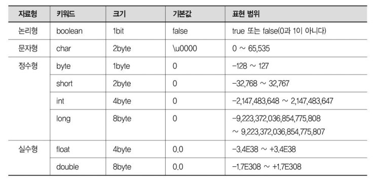

# Primitive data type & Reference data type

</br>

자바에는 기본 자료형 (primitive data type) / 참조 자료형(reference data type) 이 있다.

**기본 자료형 (primitive data type)**

-   논리형 : boolean
-   문자형 : char
-   정수형 : byte, short, int, long
-   실수형 : float, double

**참조 자료형 (reference data type)**

-   class type (클래스)
-   interface type (인터페이스)
-   array type (배열)
-   enum type (열거)
-   기타..


## 기본자료형(Primitive Data Type)

자바 컴파일러에 의해서 해석되는 자료형태를 기본 자료형이라고 한다.

**[특징]**

- 총 8가지의 기본형을 미리 정의하고 제공한다.
- 기본 자료형은 반드시 사용하기 전에 선언(Declared)되야 한다.
- OS(운영체제)에 따라 자료형의 길이가 변하지 않는다.
- 비객체 타입이다. 따라서, null 값을 가질 수 없다.  
    만약 기본형에 null을 넣고 싶다면, Wrapper Class를 활용해야 한다.
- 스택(Stack) 메모리에 저장된다.




#### boolean    
- 논리형인 boolean의 기본값은 false이며 참과 거짓을 저장하는 타입.
주로 yes/no, on/off 등의 논리 구현에 주로 사용되며 두가지 값만 표현하므로 가장 크기가 작다.

- boolean은 실제로 1bit면 충분하지만, 데이터를 다루는 최소 단위가 1byte이므로 메모리 크기가 1byte이다.

#### char
- 문자형인 char는 2byte의 문자하나를 입력하는 데이터형이다.
- 문자 1개를 저장하는 데이터형이라고 아는것이 중요
-   char 변수명 = '값';

#### byte
- byte는 주로 이진데이터를 다루는데 사용되는 타입.

#### short
- short는 C언어와의 호환을 위해 사용되는 타입으로 잘 사용되지는 않는 타입

#### int

- int 형은 자바에서 정수 연산을 하기 위한 기본 타입.  
즉, byte 혹은 short 의 변수가 연산을 하면 연산의 결과는 int형이 된다.

#### long
- 수치가 큰 데이터를 다루는 프로그램(은행 및 우주와 관련된 프로그램)에서 주로 사용.
- long 타입의 변수를 초기화 할 떄에는 정수값 뒤에 알파벳 L을 붙여서 long 타입(즉, 8byte)의 정수 데이터임을 알려주어야 한다.   
만일 정수값이 int의 값의 저장 범위를 넘는 정수에서 L을 붙이지 않는다면 컴파일 에러가 발생한다.

```java
long l = 2147483648; // 컴파일 에러 발생 long l = 2147483648L;
```

#### float, double
- float(4바이트) / double(8바이트)
- 실수를 가수와 지수 형식으로 저장하는 부동소수점 방식으로 저장된다.
- 가수를 표현하는데 있어 double형이 float형보다 표현 가능 범위가 더 크므로 double형이 보다 정밀하게 표현할 수 있다.
- 자바에서 실수의 기본 타입은 double형이므로 float형에는 알파벳 F를 붙여서 float 형임을 명시해주어야 합니다.

```java
float f = 1234.567; // 무조건 double 타입으로 이해하려고 하므로 컴파일 에러가 발생합니다.

float f = 1234.567F; // float type이라는 것을 표시해야 합니다.
```

</br>

## 참조자료형(Reference Data Type)

JAVA에서 기본형(Primitive type)을 제외한 타입들이 모두 참조형(Reference type) 이다.

참조형(Reference type)은 JAVA에서 최상인 **java.lang.Object**클래스를 상속하는 모든 클래스들을 말한다.  

물론 new로 인하여 생성하는 것들은 메모리 영역인 Heap 영역에 생성을 하게되고, **Garbage Collector**가 돌면서 메모리를 해제한다.

**클래스 타입(class type)**,**인터페이스 타입(interface type)**,**배열 타입(array type)**,**열거 타입(enum type)** 이 있다.

**[특징]**

빈 객체를 의미하는 Null이 존재한다.

문법상으로는 에러가 없지만 실행시켰을 때 에러가 나는 런타임 에러가 발생한다.  

예를 들어 객체나 배열을 Null 값으로 받으면 NullPointException이 발생하므로 변수 값을 넣어야 한다.

Heap 메모리에 생성된 인스턴스는 메소드나 각종 인터페이스에서 접근하기 위해 JVM의 Stack 영역에 존재하는 Frame에 일종의 포인터(C의 포인터와는 다르다)인 참조값을 가지고 있어 이를 통해 인스턴스를 핸들링한다.


</br>

### String Class (문자열)

String Class는 참조형에 속하지만 기본적인 사용은 기본형 처럼 사용한다.

**[특징]**

-  불변(immutable)하는 객체이다.
-  String 클래스에는 값을 변경해주는 메소드들이 존재하지만, 해당 메소드를 통해 데이터를 바꾼다 해도 새로운 String 클래스 객체를 만들어내는 것이다.
-  일반적으로 기본자료형의 비교는 == 연산자를 사용하지만  
String 객체간의 비교는 .equals() 메소드를 사용해야 한다.

---

</br>

**[참고 링크]**

[링크1](https://gyoogle.dev/blog/computer-language/Java/Primitive%20type%20&%20Reference%20type.html#abstract)

[링크2](https://blog.naver.com/satyee/140127143696)
