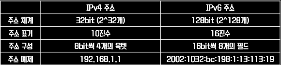

# IP Address

> 컴퓨터 네트워크에서 장치들이 서로 인식하고 통신하기위해 사용되는 주소

IP 주소는 네트워크 계층에서 사용하는 주소이며, IP 헤더에 포함된 데이터 주소이다.

흔히 ip라는 단어 뒤에 주소라는 말을 붙여 IP 주소라고 하는데,

IP 주소는 이런 프로토콜 안에서 데이터가 전송되어야 하는 곳의 주소를 지칭한다고 보면된다.

### IP 주소란?

컴퓨터를 , 더 정확히는 인터넷에 접속해서 무엇인가 하다 보면 자주 접하는 용어중 하나다.

ip라는 단어 자체는 internet protocol의 준말이며,

이름이 말해주듯 인터넷 사용에 있어 데이터(패킷)를 주고받는 것과 관련된 `규약`이다.

즉, 프로토콜 중 하나 이다.

패킷이 어떤 식으로 작성되어야 하고 , 주소를 어떻게 탐색할지에 대한 룰을 정해놓은 것이라 볼 수 있다.

다른 인터넷 통신 프로토콜 중 TCP(transmission Control Protocol)이라는 개념이 있는데,

TCP 가 데이터의 효율적인 전달(쪼개고 합치기)과 관련된 규칙을 담당한다면,

IP는 이런 데이터를 어떻게 어디로 전달하면 되는지와 관련된 규칙을 담당한다고 생각하면된다.

## IP 주소 유형

### IPv4 & IPv6

IP 주소의 표기 방법은

IPv4는 1983년에 서비스 시작, 아래와 같이 8비트 4개의 조합, 즉 총합 32비트로 이루어진 표기 방식을 사용했다.

IPv6는 1999년도에 서비스 시작, IPv4의 고갈로 크기를 128비트로 늘린 IP주소이다.



```
IPv4

255.255.255.255 192.168.0.1
```

온점으로 구분된 숫자들을 옥텟이라고 부르며, 8비트로 표기된 2진수의 10진수 표기법이다.

**[참고]**

그래서 IPv4의 주소는 이렇게 적힌걸 기준으로 10진수 변환한 것이라도 보면된다

```
11111111.11111111.11111111.11111111 (255.255.255.255)
11000000.10101000.00000000.00000001 (192.168.0.1)
```

옥텟이 비트로 이루어진 것을 이해해야 이후에 서브넷 주소와 CIDR표기 방식에서 이해가 수월하다.

이 표기법의 가장 큰 문제라고 하면, 조합이 42억 개정도에 불과하다는 점이다.

현재 수많은 기기와 무수히 많은 네트워크가 동작하고 있는 인터넷 세상에서 IPv4형식으로 작성된 42억 개의 IP 주소는 이미 고갈 상태이다. 이를 해결하기 위해 더 많은 조합이 가능한 IPv6로 옮겨가고 있지만, 아직은 IPv4에 의존하고 있다.

### 루프백 주소(loop back)

-   호스트 자신을 가리키는 IP주소(127.0.0.1)
-   프로그램을 빠르게 테스트 하는 용도로 사용

---

</br>

**[참고 및 출처]**

[링크1](https://m.blog.naver.com/PostView.nhn?blogId=hatesunny&logNo=220790654612&proxyReferer=https:%2F%2Fwww.google.com%2F)

[링크2](https://stitchcoding.tistory.com/4)
