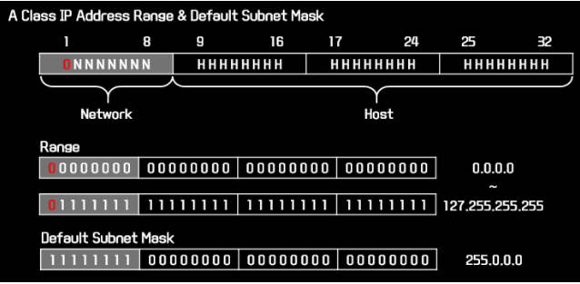
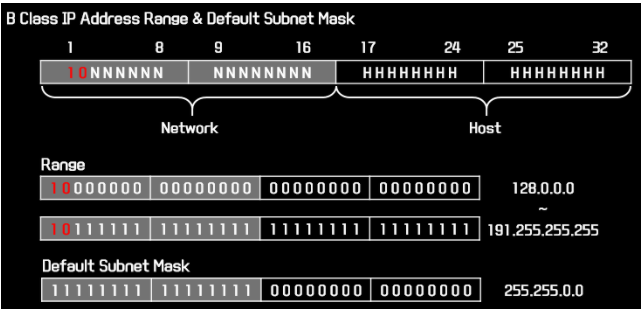
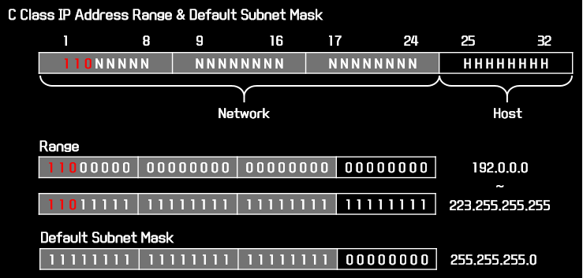
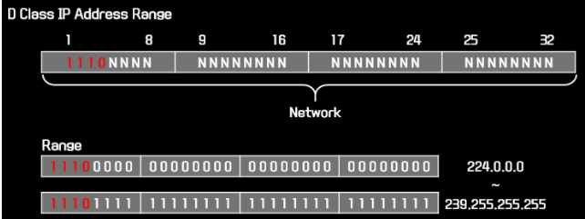
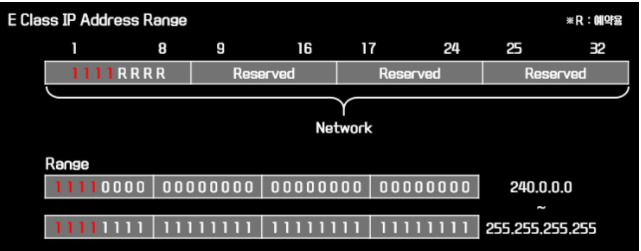
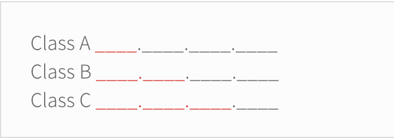

# IP Adress Class
**IP 주소의 클래스**

클래스 는 IP주소의 타입이라고 생각할 수 있다.

IPv4에는 총 5가지 클래스가 있다. A, B, C, D, E

IP 주소의 범위는 0.0.0.0 ~ 255.255.255.255까지 포함될 수 있다.

하지만 5개의 클래스로 정의되면서 IP 주소 낭비 방지와 효율적인 서브넷 관리가 가능하다.

---

### A Class

-   A 클래스의 IP주소는 첫 번째 옥텟이 0 ~ 127.
-   **사설 IP**는 10.0.0.0 ~ 10.255.255.255.

첫 번째 필드를 2진수로 변환할 경우 맨 앞에 0이라는 공통 비트를 갖는다면 A Class로 정의한다.

(00000000 ~ 01111111 즉 0부터 127까지)

A Class 가 사용하는 기본 서브넷 마스크는 255.0.0.0이며 호스트 ID가 24bit 이므로 네트워크 id당 나올 수 잇는 IP 주소 개수는 2^24개 (즉, 16,777,216개가 된다)

---

### B Class

-   B 클래스의 IP주소는 첫 번째 옥텟이 128 ~ 191.
-   **사설 IP**는 172.16.0.0 ~ 172.31.255.255

첫 번째 필드를 2진수 변환할 경우 맨 앞에 10이라는 공통 비트를 갖는다면 B Class로 정의한다.

(10000000 ~ 10111111 즉, 128 ~ 191까지)

B Class 가 사용하는 기본 서브넷 마스크는 255.255.0.0이며 호스트 아이디가 16bit 이므로 네트워크 id 당 나올 수 있는 IP 주소 개수는 2^16개 (즉, 65,536개가 된다)

---

### C Class

-   C 클래스의 IP주소는 첫 번째 옥텟이 192 ~ 223.
-   **사설 IP**는 192.168.0.0 ~ 192.168.255.255

첫 번째 필드를 2진수 변환할 경우 맨 앞에 110이라는 공통 비트를 갖는다면 C Class로 정의한다.

(11000000 ~ 11011111 즉, 192 ~ 223까지)

C Class 가 사용하는 기본 서브넷 마스크는 255.255.225.0이며 호스트 아이디가 8bit 이므로 네트워크 id 당 나올 수 있는 IP 주소 개수는 2^8개 (즉, 256개가 된다)

---

**D와 E 클래스는 멀티캐스팅이나 정부 차원에서 사용하는 특수한 클래스이다**

### D Class

-   (11100000 ~ 11101111, 즉, 244 ~ 239까지)
-   멀티캐스트 주소로 예약되어 있으며 서브넷 마스크를 이용하여 블락 단위로 동작하지 않기 때문에 서브넷 마스크를 사용하지 않는다.

---

### E Class

-   (11110000 ~ 11111111, 즉, 240 ~ 255까지)
-   IANA에서 사용을 제한 시킨 주소이기 때문에 네트워크 인터페이스 설정이 불가능 하다.

---

우리가 흔히 **localhost**라고 지칭하는 127.0.0.1에서 127의 경우 엄밀히 따지자면

A 클래스에 속하겠지만, 보통은 자기 자신인 것도 참고하면 좋을 것 같다.

이를 **local loopback**이라고 부른다.

IP 주소의 클래스 구분은 단순히 첫 번째 옥텟의 숫자 범위만이 아니라 어디까지가 네트워크 id이고 호스트 영역인지를 구분하는 기준이 되기도 한다.

아래에 색이 칠해진 부분이 각 클래스별 네트워크id의 영역이다.

자연스럽게 클래스 A의 네트워크는 24비트의 조합만큼의 호스트를 포함할 수 있기 때문에 규모가 큰 기관에서 주로 사용했던 것으로 이해할 수 있다.

그리고 같은 로직으로 클래스 C의 네트워크는 소규모 기관에서 사용했던 것이다.

---

 

**[참고 및 출처]**

[링크1](https://m.blog.naver.com/PostView.nhn?blogId=hatesunny&logNo=220790654612&proxyReferer=https:%2F%2Fwww.google.com%2F)

[링크2](https://stitchcoding.tistory.com/4)
