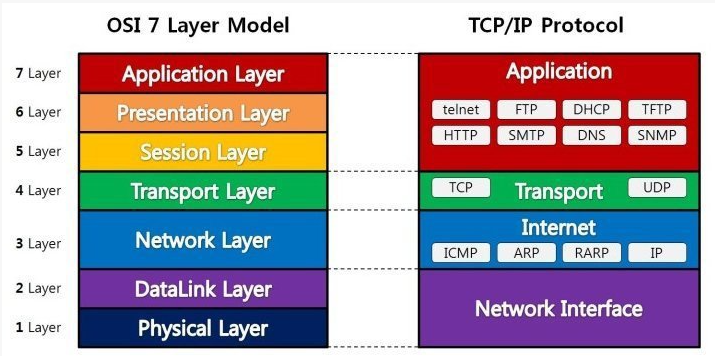
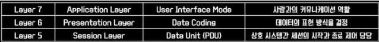
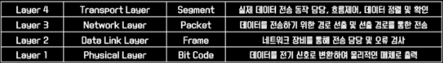

# OSI 7 Layer

OSI(Open System Interconnnection) 참조 모델은 컴퓨터 응용 프로그램 정보가 다른 컴퓨터 응용프로그램으로 어떤 과정을 통해서 이동하는지 설명한다.  
네트워크 설계를 하기 위한 프레임워크를 제공하며(호환성) 네트워크 장애 발생시 문제 해결 방법을 체계적으로 접근하기 위해서 필요하다. (트러블 슈팅)

OSI모델은 컴퓨터 네트워크와 관련하여 각종 프로토콜과 관련 기술을 계층으로 분리하여 정리한 것이라고 쉽게 생각할 수 있다.

`프로토콜`은 일종의 규약 혹은 약속이다.

네트워크를 통해 통신하기 위해 모두가 동일한 규칙 아래 움직이기 위해 약속을 하는 것이다.

네트워크는 워낙 방대하고 복잡한 과정을 거치기 때문에 하나의 규정 아래 모든 과정을 우겨넣는 것이 아니라 역할에 따른 여러 계층으로 나누어 정리하고 있다.

### 계층을 나누어 정리한 이유?

통신이 일어나는 과정을 단계별로 알 수 있고, 특정한 곳에 이상이 생기면 그 단계만 수정할 수 있기 때문이다.

통신 중 문제가 발생할 때, 문제가 일어나는 부분만을 살펴보면 되므로 유용하다.

이런 식으로 계층을 나누어 정리한 모델이 OSI 참조 모델이고

OSI 참조 모델은 상위 계층과 하위계층으로 구분되며 세부적으로 일곱 가지 계층(레이어)으로 구성되어 있다.

---

## **OSI 7계층**

### **1 - 물리 계층(Physical layer)**

> 리피터, 케이블, 허브 등

단지 데이터 전기적인 신호로 변환해서 주고받는 기능을 진행하는 공간

즉, 데이터를 전송하는 역할만 진행한다.

하드웨어 전송 기술과 관련이 있다.

### **2 - 데이터 링크 계층(Data link layer)**

> 브릿지, 스위치 등

물리 계층으로 송수신되는 정보를 관리하여 안전하게 전달되도록 도와주는 역할

Mac 주소를 통해 통신한다. 프레임에 Mac 주소를 부여하고 에러검출, 재전송, 흐름제어를 진행한다.

네트워크 위의 개체들 간 데이터를 전달하고, 물리 계층에서 발생할 수 있는 오류를 찾아내고, 수정하는 데 필요한 기능적, 절차적 수단을 제공합니다.

### **3 - 네트워크 계층(Network layer)**

> 라우터, IP

데이터를 목적지까지 가장 안전하고 빠르게 전달하는 기능을 담당한다.

여러 개의 노드를 거칠 때마다 경로를 찾아주는 역할을 하는 계층으로 다양한 길이의 데이터를 네트워크들을 통해 전달하고, 그 과정에서 전송 계층이 요구하는 서비스 품질(QoS)을 제공하기 위한 기능적, 절차적 수단을 제공한다.

즉, 어디로 연결이 되어야 목적지에 도달할 수 있을지를 고민하고 패킷을 전송하는 것과 관련된 계층이라고 할 수 있다.

그런 이유로 라우팅이나 IP도 이 계층의 프로토콜에 속한다.

### **4 - 전송 계층(Transport layer)**

> TCP, UDP

TCP, UDP 프로토콜을 통해 통신을 활성화한다.

포트를 열어두고, 프로그램들이 전송을 할 수 있도록 제공해 준다.

-   TCP : 신뢰성, 연결지향적
-   UPD: 비신뢰성, 비연결성, 실시간

사용자 간의 데이터 흐름과 관련된 계층이다. 이 계층에 속하는 대표적인 프로토콜이 바로 TCP, UDP이다.

### **5 - 세션 계층(Session layer)**

> API, Socket

데이터가 통신하기 위한 논리적 연결을 담당한다.

TCP/IP 세션을 만들고 없애는 책임을 지니고 있다.

양 끝단의 응용 프로세스가 통신을 관리하기 위한 방법을 제공한다.

### **6 - 표현 계층(Presentation layer)**

> JPEG, MPEG등

데이터 표현에 대한 독립성을 제공하고 암화하는 역할을 담당한다.

코드 간의 번역을 담당한다.

파일 인코딩, 명령어를 포장, 압축, 암호화한다.

### **7 - 응용 계층(Application layer)**

> HTTP, FTP, DNS 등

최종 목적지로, 응용 프로세스와 직접 관계하여 일반적인 응용 서비스를 수행한다.

사용자 인터페이스, 전자우편, 데이터베이스 관리 등의 서비스를 제공한다.

실제 사용자와 맞닿아있는 서비스를 구현하기 위한 프로토콜의 모음이라고 생각하면 쉽다.

구체적으로는 응용 프로세스와 직접 관계하여 일반적인 응용 서비스를 수행한다.

일반적인 응용 서비스는 관련된 응용 프로세스들 사이의 전환을 제공한다.

대표적인 예시로는 DNS, DHCP, HTTP, HTTPS, FTP, SSH, Telnet 등이 있다.

---

### **상위계층 (Upper Layer)**

상위 계층은 데이터 생성을 담당한다. (PDU 생성, Protocol Data Unit)

일반적으로 소프트웨어로 구현된고 OS가 그 일을 담당한다.

(세션, 표현, 응용)

### **하위 계층 (Lower Layer)**

하위 계층은 데이터 전송을 담당한다.

(물리, 데이터 링크, 네트워크, 전송)

---

 

**[참고 및 출처]**

[링크1](https://m.blog.naver.com/PostView.nhn?blogId=hatesunny&logNo=220790654612&proxyReferer=https:%2F%2Fwww.google.com%2F)

[링크2](https://stitchcoding.tistory.com/4)
