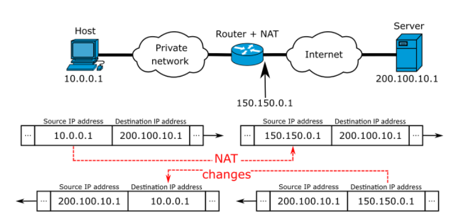

# Port & NAT

하나의 와이파이를 사용하는 모든 기기는 하나의 공인 ip 주소를 갖게 된다.

여러기기가 하나의 네트워크(라우터)에 연결되어 있는 것을 LAN(Local-Area Network)라고 부른다.

그리고 라우터를 통해 연결되는 외부의 네트워크들이 모여 있는 것을 WAN(Wide-Area Network)라고 부른다.

결국 인터넷은 거대한 WAN인 셈이다.

그렇다면 WAN을 통해서 우리 집 라우터의 공인 IP로 전송되는 데이터가 있을 때, 이것이 어떻게 딱딱 올바른 기기에게 전달되며 내 컴퓨터의 사설 IP와 공인 IP가 다른데 외부에서 접근할 수 있는가?

사설 IP를 공인 IP와 매핑해주는 것은 NAT(Network Address Translation) 이다.

그럼 IP가 변경된 것은 좋은데, 어떻게 특정 데이터는 내 컴퓨터로, 또 다른 데이터는 내 스마트폰으로 넘어가는 걸까?

외부에서 어떻게 LAN 안에 있는 각각의 컴퓨터나 서비스에 접근할 수 있을까?

이것은 포트와 관련이 있다.

포트 포워딩은 외부에서 LAN안에 있는 기기나 서비스에 접근할 때 사용되는 기술이다.

각각의 IP는 여러 포트를 가지고 있다.

한마디로, 인터넷에서 무언가 들어올 수 있는 통로가 각각의 컴퓨터(혹은 기기)마다 여러 개 있다고 생각하면 쉽다.

그리고 우리의 라우터 또한 포트가 여럿 있다.

이럴 때, 우리가 사용하는 라우터의 특정 포트 번호로 들어오는 데이터를 LAN에 연결된 다른 IP주소의 특정 포트로 보내도록 지시하는 것이 바로 포트 포워딩이다.

### 디폴트 게이트웨이

게이트웨이라 함은, 다른 네트워크로 통하는 액세스 포인트로 이해할 수 있다.

라우터가 있다면, 그 라우터의 ip주소를 의미하게 된다.

정확히는 라우터의 사설 IP 주소일 것이고, 기본적으로는 가능한 호스트 중 가장 첫 번째이다.

만약 내 컴퓨터의 사설 IP주소가 192.168.0.4라고 했을 때, 디폴트 게이트웨이는 192.168.0.1 인 것이다.

디폴트 게이트웨이를 주소창에 치고 접속하면 라우터 설정으로 넘어가게 된다.

---

 

**[참고 및 출처]**

[링크1](https://stitchcoding.tistory.com/4)
