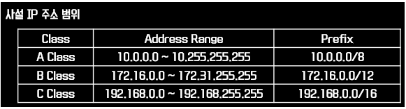

# Public IP & Private IP

  

## Public IP
**공인 IP**

> 공인된 할당기관에서 할당해준 IP주소, 인터넷 상에서 사용할 수 있다.  

**공인 IP주소**는 어떠한 네트워크가 갖는 고유한 주소,

즉, 인터넷과 같은 공인 환경에 직접 연결이 가능한 주소를 말한다.

인터넷을 하기 위해서는 공인 IP 주소가 필요하며 이 주소는 ISP 업체로 부터 임대를 받아서 사용해야 한다.

## Private IP
**사설 ip**

> 내부 네트워크에서만 사용하는 IP주소, 인터넷 상에서 사용할 수 없음(폐쇄형)  

**사설 IP주소**는 하나의 네트워크 안에서 주어지는 상대적인 주소이다.

즉, 공인 환경이 아닌 기업 내부 사설 환경에서 사용을 권장하는 주소이다.

이 주소는 인터넷과 연결이 되지 않기 때문에

(WAN 구간을 연결하는 Router(라우터)는 사설 IP주소를 외부로 전송할 수 없다)

다른 환경과 중첩하여 주소 범위를 사용해도 무관하여 ISP 업체로 부터 임대를 받지 않아도 사용할 수 잇다.

### 비유)

늘 단골로 등장하는 비유는 집 주소로, 무슨 시 무슨 구 무슨 로 몇 동 몇 호 같은 건 어디서 보든 한 곳을 가리키는 공인 주소이지만,

단순히 203호, 501호 같은 형태의 주소는 어떤 건물인지, 어떤 구인지에 따라 상대적이다.이것이 사설 IP주소라고 볼 수 있다.

### 탄생배경)

이런 개념의 탄생 배경은 IPv4가 할당할 수 있는 네트워크 수가 고갈되고 있고, 지금은 과거와 비교해 무수히 많은 기기가 인터넷에 접근해야 하기 때문이다.

모두가 익숙한 와이파이의 개념으로 풀어보자면 공인 IP는 라우터의 주소, 사설 IP는 그 라우터에 연결된 각각의 기기의 주소 이다.

이렇게 하면, 우리 집에는 하나의 네트워크만이 연결되지만, 그 안에서 많은 기기가 고유한 주소를 가진 채로 그 네트워크를 통해 다른 네트워크와 소통할 수 있는 것이다.

단, 다른 집의 다른 네트워크의 컴퓨터가 내 컴퓨터와 동일한 사설 IP를 가질 수 있다.

물론 그 두 컴퓨터의 공인 IP는 각자의 라우터가 받아오는 네트워크의 주소일 것이기 때문에 다르다.

위에서 설명한 사설 IP주소의 범위는 일반적으로 사설 IP로 활용할 수 있도록 각각의 클래스에서 공인 IP로 사용되지 않게 분리해둔 주소이다. 그래서 집 컴퓨터의 IP를 찾아보면 주로 192.168.0.으로 시작하는 주소를 볼 수 있는데, 이것이 바로 사설 IP주소이다.

만약 온라인에서 내 컴퓨터의 IP주소 찾기를 했는데 이것과 다른 주소가 나온다면 혼란을 느끼지 않아도 된다. 그건 내 컴퓨터가 연결되어 있는 라우터의 공인 IP주소로, 외부에서 내 컴퓨터에 접근할 땐 그 주소가 필요한 것입니다.

## 참고)

※인터넷을 하기위해서는 정해진 기관내에서 할당하는 공인 ip를 사용해야 한다.

즉, 사용자는 ISP 업체로부터 공인 IP를 임대 받아야 하지만 인터넷 서비스와 연결을 할 수 있다.

전 세계적으로 인터넷 상에서 사용되는 IP 주소와 도메인을 관리하는 기관은 IANA(Internet Assigned Numbers Authority)이다.

---
 

**[참고 및 출처]**

[링크1](https://m.blog.naver.com/PostView.nhn?blogId=hatesunny&logNo=220790654612&proxyReferer=https:%2F%2Fwww.google.com%2F)

[링크2](https://stitchcoding.tistory.com/4)
