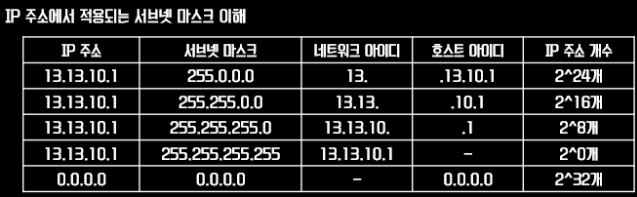

# Subnet Mask
**서브넷**

서브넷은 말 그대로, 작은(혹은 아래의) network,

즉 하나의 네트워크를 쪼개 만든 네트워크이다.

하나의 네트워크는 또 한 번 여러 서브넷으로 나뉠 수 있다.

네트워크를 조각내어 관리하는 것에 대한 성능면에서 장점

-   보안
-   관리
-   속도 & 성능

### [자세히]

예를 들어 회사 안에서 하나의 네트워크로 모든 기기가 연결되어 있다고 가정해보자

어떤 부서 때문에 네트워크를 통제해야 할 때, 모두 하나의 네트워크 안에 있으니 모두가 영향을 받게 된다

이렇게 하는 대신, 부서마다 네트워크를 일정 부분 떼어주고 알아서 관리하게 하면 관리도 편하고 서로 영향을 주지 않고 접속하지 못하니 부서 간의 보안도 보장이 되는 그런 원리이다.

그런데 개인적으로 의문이 들었던 부분은 그냥 새로운 네트워크를 할당받으면 되는데 왜 이렇게 쪼개는 방식을 택했을까?

이는 결국 IPv4의 고갈과도 또 관련이 있다.

앞서 설명한 LAN, NAT 또한 부족한 IPv4 주소를 어떻게든 모든 기기가 사용하여 인터넷에 연결하기 위한 방법 중 하나이듯, 서브넷도 마찬가지이다.

이를 조금 더 세부적으로 살펴보기 위해서는 넷마스크, 혹은 서브넷 마스크가 무엇이며 이를 표기하기 위한 방법인 CIDR를 살펴보면 이해에 도움이 된다.

---

## 서브넷 마스크

IP 주소에 대한 네트워크 아이디와 호스트 아이디를 구분하기 위해서 사용된다.

IP주소 32 bit에 공통 비트 1을 씌워서 네트워크를 표기하기 때문에 IP 주소와 마친가지로 32bit 체계이다.

```
맨 앞에 비트부터 1이 연속된 구간까지를 공통 비트로 처리하여 네트워크 아이디로 사용하고
O으로 끝나는 마지막 구간을까지를 공통으로 하지 않는 비트로 처리하여 아이디로 사용한다.
```



쉽게 이해를 위해 예를 들어보자

192.168.1.0 255.255.255.0 과 192.168.8.0 255.255.255.0 은 같은 네트워크 대역일까?

정답은 "다른네트워크 대역"이다.

이유)

192.168.1.0의 주소 범위를 알아보자

서브넷 마스크가 255.255.255.0 이므로 네트워크 아이디는 192.168.1 이고 호스트 아이디는 .0이다.

따라서 범위는 192.168.1.0 ~ 192.168.1.255까지가 된다.

결론은 192.168.8.0은 같은 대역 안에서 포함되지 않는다. (192.168.8.255 ~ 192.168.8.255 범위에 포함된다)

만약 192.168.1.0 255.255.0.0과 192.168.8.0 255.255.0.0이라면 같은 네트워크 대역이 된다.

서브넷 마스크가 255.255.0.0이므로 네트워크ID는 192.168.이고 호스트ID는 .0.1이다.

따라서 범위는 192.168.0.0 ~ 192.168.255.255까지가 된다.

---

클래스의 기준은 맨 앞의 옥텟의 숫자가 다른 것도 있지만, 몇 번째 옥텟까지가 네트워크 아이디를 결정하는지에서 차이를 보인다.

네트워크 아이디의 영역이 길 수록, 해당 네트워크의 호스트 수는 당연히 적을 수밖에 없다.

서브넷 마스크는 이렇게 IP주소를 읽을 때 어디까지가 네트워크 아이디인지를 알려주는 척도가 된다.

```
192.168.0.1 (주소)
255.255.255.0 (서브넷 마스크)
```

클래스 C라면 192.168.0까지가 네트워크 ID, 뒤에 1이 호스트 ID가 된다.

즉, 옥텟 3개까지가 네트워크 ID로서 유효하다는 뜻이다.

그렇기에 하단에 적힌 255.255.255.0 이 클래스 C의 서브넷 마스크가 된다.

간단하게 해석하자면, 서브넷 마스크를 2진수로 풀었을 때 1인 자릿수까지 실제 IP주소에서 네트워크 ID 영역이라는 의미이다.

그래서 클래스 A라면 255.0.0.0, 클래스 B라면 255.255.0.0 이 됩니다.

```
11000000.10101000.00000000.00000001 (192.168.0.1)

11111111.11111111.11111111.00000000 (255.255.255.0)
```

그런데 이렇게만 하면 어떤 문제가 있을까?

IPv4의 주소 수는 부족한데, 낭비되는 주소가 생긴다.

클래스 C의 경우 대략 250개 정도의 호스트를 보유할 수 있는데,

어떠한 기관에서 예를 들어 100개 정도의 호스트만 감당할 수 있는 네트워크를 필요로 한다고 가정해보면, 클래스로만 구분된 네트워크로만 할당을 하자니 제일 작은 클래스 C의 호스트 수는 벌써 200개가 넘는다.

이러면 100 이상은 사용되지도 못하고 낭비되는 것이다.

그럼 이걸 한번 더 쪼개면 좋지 않을까?

이런 발상에서 시작한 것이 바로 **`CIDR(Classless Inter-Domain Routin` 이다**.

---

</br>

**[참고 및 출처]**

참고링크)

[링크1](https://m.blog.naver.com/PostView.nhn?blogId=hatesunny&logNo=220790654612&proxyReferer=https:%2F%2Fwww.google.com%2F)

[링크2](https://stitchcoding.tistory.com/4)
