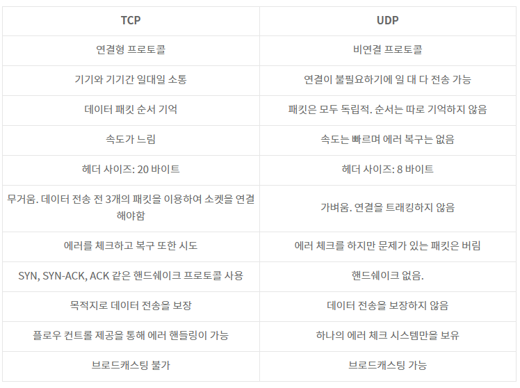

# TCP & UDP

**TCP**는 Transmission Control Protocol,

**UDP**는 User Datagram Protocol

의 준말로 두 프로토콜 모두 데이터 전송(패킷 전송)과 관련이 있다.

아주 간단하게 말한다면,

TCP는 정확도와 보안을 중요하게 생각하는 대신 속도가 느리고,

UDP는 정확도나 보안을 포기하는 대신 속도가 굉장히 빠르다고 볼 수 있다

#### [TCP & UDP의 큰 특징]



## TCP

```
데이터를 메시지의 형태로 보내기 위해 IP와 함께 사용하는 프로토콜.

연결 지향적 서비스로 데이터 전송의 높은 신뢰성 보장
```

**데이터의 분실, 중복, 순서가 뒤바뀜 등을 자동으로 보정해줘서 송수신 데이터의 정확한 전달을 할 수 있도록 해준다.**

**정확성 높은 전송을 하기 위해 속도가 느린 단점이 있고, 주로 웹 HTTP 통신, 이메일, 파일 전송에 사용된다.**

TCP는 서버와 클라이언트의 함수 호출 순서가 중요하다

**서버**

socket() 생성 → bind() 소켓 주소할당 → listen() 연결요청 대기상태 → accept() 연결허용

→ read/write() 데이터 송수신 → close() 연결종료

**클라이언트**

socket() 생성 → connect() 연결요청 → read/write() 데이터 송수신 → close() 연결종료

**서버 & 클라이언트 둘의 차이는?**

클라이언트 소켓을 생성한 후, 서버로 연결을 요청하는 과정에서 차이가 존재한다.

서버는 listen() 호출 이후부터 연결요청 대기 큐를 만들어 놓고, 그 이후에 클라이언트가 연결 요청을 할 수 있다.

이때 서버가 바로 accept()를 호출할 수 있는데, 연결되기 전까지 호출된 위치에서 블로킹 상태에 놓이게 된다.

이처럼 연결지향적인 TCP는 신뢰성 있는 데이터 전송이 가능하다. (3-way handshaking)

흐름제어와 혼잡제어를 지원해서 데이터 순서를 보장해준다.

-   흐름제어 : 송신 측과 수신 측의 데이터 처리 속도 차이를 조절해주는 것
-   혼잡 제어 : 네트워크 내의 패킷 수가 넘치게 증가하지 않도록 방지하는 것

## UDP

```
데이터그램 단위로 처리하는 프로토콜.

비연결형 프로토콜, 신뢰성 낮음. TCP 보다 빠름
```

IP가 제공하는 정도의 수준만을 제공하는 간단한 IP 상위 계층의 프로토콜이다.

TCP와는 다르게 에러가 날 수도 있고, 재전송이나 순서가 뒤바뀔 수도 있어서 이 경우, 어플리케이션에서 처리하는 번거로움이 존재한다.

</br>

**[특징]**

TCP의 대안으로, IP와 같이 쓰일 땐 UDP/IP라고도 부른다.

TCP와 마찬가지로, 실제 데이터 단위를 받기 위해 IP를 사용한다.

그러나 TCP와는 달리 메시지를 패킷으로 나누고, 반대편에서 재조립하는 등의 서비스를 제공하지 않는다.

즉, 여러 컴퓨터를 거치지 않고 데이터를 주고 받을 컴퓨터끼리 직접 연결할 때 UDP를 사용한다.

UDP를 사용해 목적지(IP)로 메시지를 보낼 수 있으며, 컴퓨터를 거쳐 목적지까지 도달할 수도 있다.

(도착하지 않을 가능성도 존재함)

정보를 받는 컴퓨터는 포트를 열어두고, 패킷이 올 때까지 기다리며 데이터가 오면 모두 다 받아들인다. 패킷이 도착했을 때 출발지에 대한 정보(IP와 PORT)를 알 수 있다.

**UDP는 이런 특성 때문에 비신뢰적이고, 안정적이지 않은 프로토콜이다.**

**하지만 TCP보다 속도가 매우 빠르고 편해서 데이터 유실이 일어나도 큰 상관이 없는 스트리밍이나 화면 전송에 사용된다.**

</br>

### UDP는 왜 사용할까

-   UDP의 결정적인 장점은 데이터의 신속성이다. 데이터의 처리가 TCP보다 빠르다.
-   주로 실시간 방송과 온라인 게임에서 사용된다. 네트워크 환경이 안 좋을때, 끊기는 현상을 생각하면 된다.

---

### DNS에서 UDP를 사용하는 이유

**DNS(Domain Name Servcie)**

-   Request의 양이 작음 -> UDP Request에 담길 수 있다.
-   3 way handshaking으로 연결을 유지할 필요가 없다. (오버헤드 발생)
-   Request에 대한 손실은 Application Layer에서 제어가 가능하다.
-   DNS : port 53번
-   But, TCP를 사용할 때가 있다! 크기가 512(UDP 제한)이 넘을 때, TCP를 사용해야한다.

---

**[참고 및 출처]**

[TCP vs UDP: What's the Difference?](https://www.guru99.com/tcp-vs-udp-understanding-the-difference.html)
